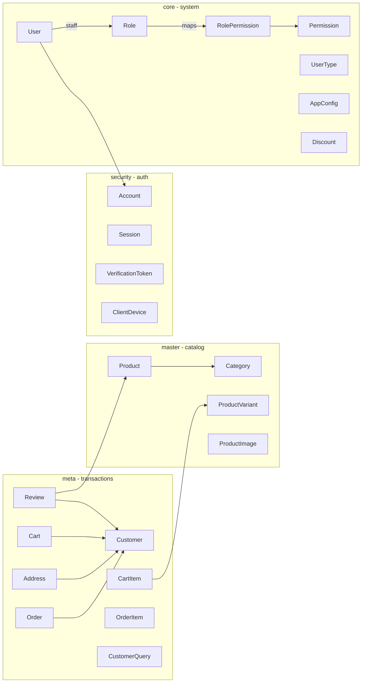

# Admin auth, four-schema ownership, and product CMS

## Target ownership

| Schema | Models |
|---|---|
| **master** | `Category`, `Product`, `ProductVariant`, `ProductImage` |
| **core** | `Role` (`isSystem`), `Permission`, `RolePermission`, `UserType`, `User` (staff), `AppConfig`, `Discount` |
| **security** | `Account`, `Session`, `VerificationToken`, `ClientDevice` |
| **meta** | `Customer`, `Address`, `Cart`, `CartItem`, `Order`, `OrderItem`, `Review`, `CustomerQuery` |

**Identity split:**
- **`User` (core)** = staff/system accounts with `passwordHash` for admin login.
- **`Customer` (meta)** = storefront buyers; owns addresses, carts, orders, reviews.

Nest modules: `apps/api/src/module/{master|core|meta|security}/`.  
Shared RBAC: `apps/api/src/module/core/rbac/`.

---

## Staff roles & RBAC

| Role code | System | Notes |
|---|---|---|
| `SUPER_ADMIN` | yes | Full access; maps not editable in matrix (always `*`) |
| `ADMIN` | yes | Ops defaults from YAML |
| `STAFF` | yes | Narrower ops defaults |
| `CUSTOMER` | yes | Non-staff; no admin JWT paths |
| *(custom)* | no | Created in admin; soft-deletable with `roles.delete` |

**Permission catalog:** `apps/api/src/module/core/rbac/permissions.yml`  
Synced to `core.permission` on API boot. Role grants in `core.role_permission`.

**Bootstrap:** `ADMIN_EMAIL` + `ADMIN_PASSWORD` create/upgrade that user as `SUPER_ADMIN`.

**Guards:**
- `@StaffAuth()` — Super Admin / Admin / Staff
- `@PermissionsAuth('code')` — single or any-of codes

**Admin CMS surface:** `/access` — Overview, Permissions (matrix), Roles, Users.  
Nav and pages check `permissions[]` from `/api/auth/me`.

See `docs/WHAT_IS_DONE.md` for full route tables, permission codes, and current status.
