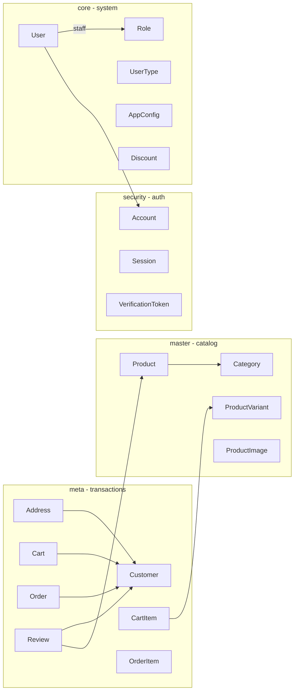

# Admin auth, four-schema ownership, and product CMS

## Target ownership

| Schema | Models |
|---|---|
| **master** | `Category`, `Product`, `ProductVariant`, `ProductImage` |
| **core** | `Role`, `UserType`, `User` (staff), `AppConfig`, `Discount` |
| **security** | `Account`, `Session`, `VerificationToken` |
| **meta** | `Customer`, `Address`, `Cart`, `CartItem`, `Order`, `OrderItem`, `Review` |

**Identity split:**
- **`User` (core)** = staff/system accounts with `passwordHash` for admin login.
- **`Customer` (meta)** = storefront buyers; owns addresses, carts, orders, reviews.

Nest modules: `apps/api/src/module/{master|core|meta|security}/`.

See `docs/WHAT_IS_DONE.md` for current status.
